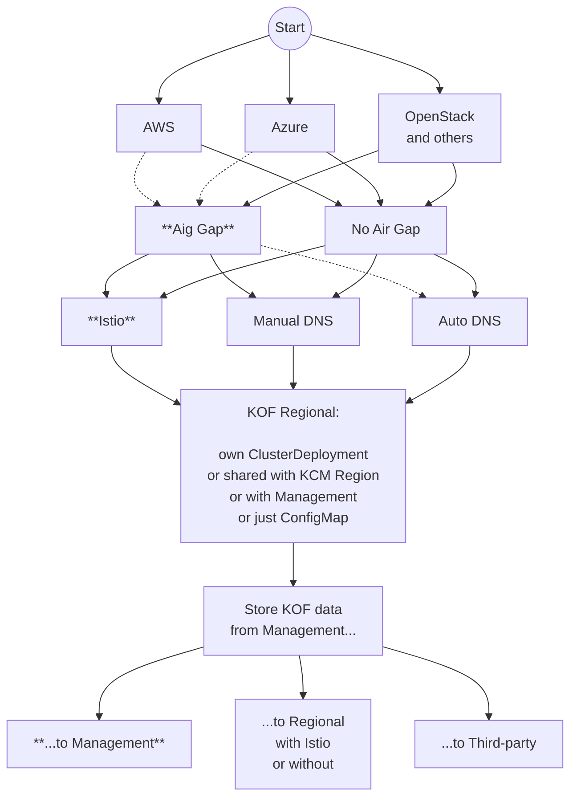

<!--mermaid-start-->

<!--mermaid-end-->

<!--image-registry-start--><!--image-registry-end-->

<!--airgap-start--><!--airgap-end-->

<!--install-istio-start-->

    ```bash
    helm upgrade -i --reset-values --wait --create-namespace -n istio-system k0rdent-istio \
      oci://ghcr.io/k0rdent/istio/charts/k0rdent-istio --version 0.2.0 \
      --set cert-manager-service-template.enabled=false \
      --set "istiod.meshConfig.extensionProviders[0].name=otel-tracing" \
      --set "istiod.meshConfig.extensionProviders[0].opentelemetry.port=4317" \
      --set "istiod.meshConfig.extensionProviders[0].opentelemetry.service=kof-collectors-daemon-collector.kof.svc.cluster.local"
    ```

<!--install-istio-end-->

<!--install-kof-operators-start-->
    ```bash
    helm upgrade -i --reset-values --wait \
      --create-namespace -n kof kof-operators \
      oci://ghcr.io/k0rdent/kof/charts/kof-operators --version {{{ extra.docsVersionInfo.kofVersions.kofDotVersion }}}
    ```
<!--install-kof-operators-end-->    

<!--install-kof-mothership-start--> 
    ```bash
    helm upgrade -i --reset-values --wait -n kof kof-mothership \
      -f mothership-values.yaml \
      oci://ghcr.io/k0rdent/kof/charts/kof-mothership --version {{{ extra.docsVersionInfo.kofVersions.kofDotVersion }}}
    ```
<!--install-kof-mothership-end--> 

<!--management-custom-start-->
        ```bash
        helm upgrade -i --reset-values --wait -n kof kof-regional \
          oci://ghcr.io/k0rdent/kof/charts/kof-regional --version {{{ extra.docsVersionInfo.kofVersions.kofDotVersion }}}

        helm upgrade -i --reset-values --wait -n kof kof-child \
          oci://ghcr.io/k0rdent/kof/charts/kof-child --version {{{ extra.docsVersionInfo.kofVersions.kofDotVersion }}}
        ```
<!--management-custom-end-->
