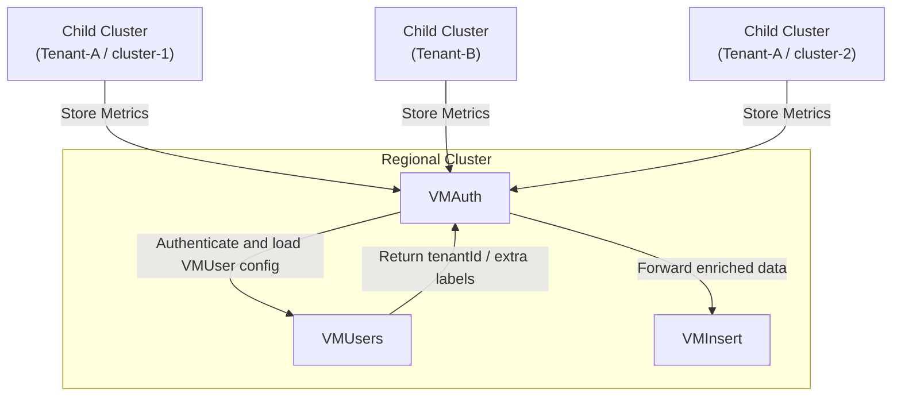

# KOF Multi-tenancy

## Overview

KOF supports multi-tenancy to isolate data (metrics, logs, and traces) between tenants. In the current implementation, a tenant is an organization with child clusters.

## Architecture

Multi-tenancy is enforced by **VMAuth** using **VMUser** resources. Each cluster gets a separate VMUser automatically.
When a tenant ID label is specified, the VMUser is configured with:

- **ExtraLabels**: adds `tenantId=<TENANT_ID>` to all ingested metrics, logs, and traces
- **ExtraFilters**: restricts read access to data matching the specified `tenantId`



This configuration ensures full isolation between tenants, allowing each to access only their own metrics, logs, and traces.

> NOTE:
> VMUser resources on regional clusters have administrative access without ExtraFilters restrictions, enabling cross-tenant data access.

## How to Enable Multi-tenancy

Add the tenant identification label to child `ClusterDeployment` resources:

```yaml
k0rdent.mirantis.com/kof-tenant-id: <TENANT_ID>
```

Dependent resources (secrets, VMUser object) will be updated or created automatically. See [storage credentials](https://github.com/k0rdent/kof/blob/main/docs/storage-creds.md) for details.
