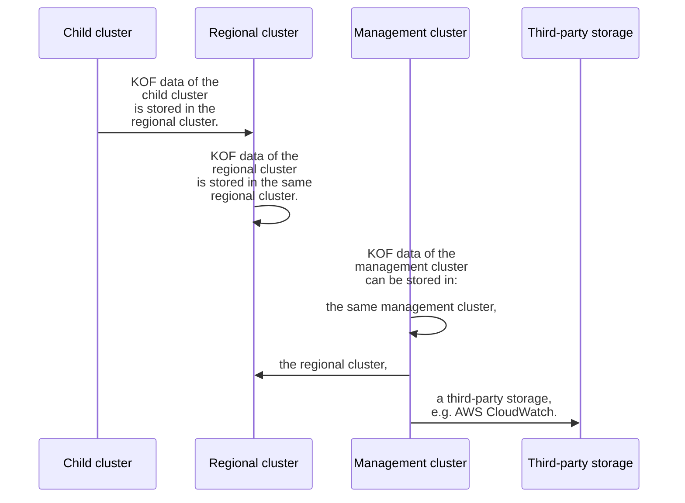

# Storing KOF data

## Overview

KOF data (metrics, logs, traces) can be collected from each cluster and stored in specific places:



## Storage Class Requirements for VictoriaMetrics Cluster

When deploying VictoriaMetrics Cluster (used by KOF for metrics storage), consider the following Kubernetes storage class requirements:

- **ReadWriteMany:** Not required. Each `vmstorage` pod uses its own PersistentVolumeClaim (PVC) and does not share volumes with other pods. A `ReadWriteOnce` access mode is sufficient and recommended for most environments.
- **Reclaim Policy:** The default `Delete` policy is typically used, but you may choose `Retain` if you want to preserve data after PVC deletion for manual recovery.
- **Volume Expansion:** Enabling volume expansion is recommended. VictoriaMetrics can benefit from expanding storage as your data grows, and resizing PVCs is supported by most modern storage classes.
- **Required Space:** Storage requirements depend on your metrics volume, retention period, and replication factor. As a starting point, allocate at least 10–50 GiB per `vmstorage` pod for small clusters, and plan for growth based on actual ingestion rates and retention settings.
- **Volume Binding Mode:** `WaitForFirstConsumer` is recommended for better pod scheduling and to ensure volumes are provisioned in the correct availability zone or node pool.

For more details, see the [VictoriaMetrics Cluster documentation](https://docs.victoriametrics.com/victoriametrics/cluster-victoriametrics/#cluster-resizing-and-scalability).

See also: [KOF Retention](./kof-retention.md) for details on configuring retention periods and replication factors for VictoriaMetrics and VictoriaLogs.

## From Child and Regional

KOF data collected from the child and regional clusters is routed out-of-the box.
No additional steps are required here.

## From Management to Management

This option stores KOF data of the management cluster in the same management cluster.

* VictoriaMetrics is provided by the `kof-mothership` chart, hence disabled in the `kof-storage` chart.
* PromxyServerGroup, VictoriaLogs, and VictoriaTraces are provided by the `kof-storage` chart.

To apply this option:

1. Modify the `kof-values.yaml` file:
    ```yaml
    kof-storage:
      values:
        enabled: true
    ```

    If you want to use a non-default storage class, add to the `kof-values.yaml` file:
    ```yaml
    kof-storage:
      enabled: true
      values:
        victoria-logs-cluster:
          vlstorage:
            persistentVolume:
              storageClassName: <EXAMPLE_STORAGE_CLASS>
    ```

2. Modify the `kof-values.yaml` file:
    ```yaml
    kof-collectors:
      enabled: true
      values:
        kcm:
          monitoring: true
        opentelemetry-kube-stack:
          clusterName: mothership
          defaultCRConfig:
            config:
              processors:
                resource/k8sclustername:
                  attributes:
                    - action: insert
                      key: k8s.cluster.name
                      value: mothership
                    - action: insert
                      key: k8s.cluster.namespace
                      value: kcm-system
              exporters:
                prometheusremotewrite:
                  external_labels:
                    cluster: mothership
                    clusterNamespace: kcm-system
    ```

3. Update the `kof` chart on the management cluster:



## From Management to Regional

This option stores KOF data of the management cluster in the regional cluster.

It assumes that:

* You did not enable Istio.
* You have a regional cluster with the `REGIONAL_DOMAIN` configured [here](./kof-install.md#regional-cluster).

To apply this option:

1. Run in the management cluster:
    ```bash
    VMUSER_CREDS_NAME=$(
      kubectl get secret -n kof \
      | grep vmuser-creds-admin \
      | cut -d ' ' -f 1
    )
    echo $VMUSER_CREDS_NAME
    ```

2. Update the `kof-values.yaml` file:
    ```bash
    cat <<EOF
    kof-collectors:
      enabled: true
      values:
        kcm:
        monitoring: true
        opentelemetry-kube-stack:
        clusterName: mothership
        collectors:
            daemon:
            hostNetwork: true
            observability:
                metrics:
                disablePrometheusAnnotations: false
                enableMetrics: false
            podAnnotations:
                prometheus.io/ip4: \${env:OTEL_K8S_NODE_IP}
            config:
                receivers:
                prometheus:
                    api_server:
                    server_config:
                        endpoint: \${env:OTEL_K8S_NODE_IP}:9090
                otlp:
                    protocols:
                    grpc:
                        endpoint: 127.0.0.1:4317
                    http:
                        endpoint: 127.0.0.1:4318
                service:
                extensions:
                    - k8s_observer
                    - file_storage/filelogreceiver
                    - file_storage/filelogsyslogreceiver
                    - file_storage/filelogk8sauditreceiver
                    - file_storage/journaldreceiver
                    - basicauth/metrics
                    - basicauth/logs
                    - basicauth/traces
                telemetry:
                    metrics:
                    readers:
                        - pull:
                            exporter:
                            prometheus:
                                host: \${env:OTEL_K8S_NODE_IP}
                                port: 8888
        defaultCRConfig:
            env:
            - name: KOF_VM_USER
                valueFrom:
                secretKeyRef:
                    key: username
                    name: $VMUSER_CREDS_NAME
            - name: KOF_VM_PASSWORD
                valueFrom:
                secretKeyRef:
                    key: password
                    name: $VMUSER_CREDS_NAME
            config:
            processors:
                resource/k8sclustername:
                attributes:
                    - action: insert
                    key: k8s.cluster.name
                    value: mothership
                    - action: insert
                    key: k8s.cluster.namespace
                    value: kcm-system
            extensions:
                basicauth/metrics:
                client_auth:
                    username: \${env:KOF_VM_USER}
                    password: \${env:KOF_VM_PASSWORD}
                basicauth/logs:
                client_auth:
                    username: \${env:KOF_VM_USER}
                    password: \${env:KOF_VM_PASSWORD}
                basicauth/traces:
                client_auth:
                    username: \${env:KOF_VM_USER}
                    password: \${env:KOF_VM_PASSWORD}
            exporters:
                prometheusremotewrite:
                endpoint: https://vmauth.$REGIONAL_DOMAIN/vm/insert/0/prometheus/api/v1/write
                auth:
                    authenticator: basicauth/metrics
                external_labels:
                    cluster: mothership
                    clusterNamespace: kcm-system
                otlphttp/logs:
                logs_endpoint: https://vmauth.$REGIONAL_DOMAIN/vli/insert/opentelemetry/v1/logs
                auth:
                    authenticator: basicauth/logs
                otlphttp/traces:
                traces_endpoint: https://vmauth.$REGIONAL_DOMAIN/vti/insert/opentelemetry/v1/traces
                auth:
                    authenticator: basicauth/traces
            service:
                extensions:
                - basicauth/metrics
                - basicauth/logs
                - basicauth/traces
        opencost:
        opencost:
            prometheus:
            existingSecretName: $VMUSER_CREDS_NAME
            external:
                url: https://vmauth.$REGIONAL_DOMAIN/vm/select/0/prometheus
    EOF
    ```

    If you're using `kind` for Management cluster, insert this:

    ```
    ...
      defaultCRConfig:
        env:
          - name: PKI_PATH
            value: etc/kubernetes
          - name: KOF_VM_USER
    ...
    ```

    > NOTE:
    > If you create this file directly, make sure to replace `\$` with `$`,
    > `$VMUSER_CREDS_NAME` with the value from step 1,
    > and `$REGIONAL_DOMAIN` with the value from [Installing KOF - Regional Cluster](kof-install.md/#regional-cluster).

3. Install the `kof-collectors` chart to the management cluster:

## From Management to Regional with Istio

This option stores KOF data of the management cluster in the regional cluster using Istio.

It assumes that:

* You have Istio enabled.
* You have a regional cluster with the `REGIONAL_CLUSTER_NAME` configured [here](./kof-install.md#regional-cluster).

To apply this option:

1. Run in the management cluster:
    ```bash
    VMUSER_CREDS_NAME=$(
      kubectl get secret -n kof \
      | grep vmuser-creds-admin \
      | cut -d ' ' -f 1
    )
    echo $VMUSER_CREDS_NAME
    ```

2. Update the `kof-values.yaml` file:
    ```bash
    cat <<EOF
    kof-collectors:
      enabled: true
      values:
        kcm:
        monitoring: true
        opentelemetry-kube-stack:
        clusterName: mothership
        collectors:
            controller-k0s:
            enabled: false
            daemon:
            hostNetwork: false
            config:
                service:
                extensions:
                    - k8s_observer
                    - file_storage/filelogreceiver
                    - file_storage/filelogsyslogreceiver
                    - file_storage/filelogk8sauditreceiver
                    - file_storage/journaldreceiver
                    - basicauth/metrics
                    - basicauth/logs
                    - basicauth/traces
        defaultCRConfig:
            env:
            - name: KOF_VM_USER
                valueFrom:
                secretKeyRef:
                    key: username
                    name: $VMUSER_CREDS_NAME
            - name: KOF_VM_PASSWORD
                valueFrom:
                secretKeyRef:
                    key: password
                    name: $VMUSER_CREDS_NAME
            config:
            processors:
                resource/k8sclustername:
                attributes:
                    - action: insert
                    key: k8s.cluster.name
                    value: mothership
                    - action: insert
                    key: k8s.cluster.namespace
                    value: kcm-system
            extensions:
                basicauth/logs:
                client_auth:
                    username: \${env:KOF_VM_USER}
                    password: \${env:KOF_VM_PASSWORD}
                basicauth/metrics:
                client_auth:
                    username: \${env:KOF_VM_USER}
                    password: \${env:KOF_VM_PASSWORD}
                basicauth/traces:
                client_auth:
                    username: \${env:KOF_VM_USER}
                    password: \${env:KOF_VM_PASSWORD}
            service:
                extensions:
                - basicauth/logs
                - basicauth/metrics
                - basicauth/traces
            exporters:
                prometheusremotewrite:
                endpoint: http://$REGIONAL_CLUSTER_NAME-vmauth:8427/vm/insert/0/prometheus/api/v1/write
                auth:
                    authenticator: basicauth/metrics
                external_labels:
                    cluster: mothership
                    clusterNamespace: kcm-system
                otlphttp/logs:
                logs_endpoint: http://$REGIONAL_CLUSTER_NAME-vmauth:8427/vli/insert/opentelemetry/v1/logs
                auth:
                    authenticator: basicauth/logs
                otlphttp/traces:
                traces_endpoint: http://$REGIONAL_CLUSTER_NAME-vmauth:8427/vti/insert/opentelemetry/v1/traces
                auth:
                    authenticator: basicauth/traces
        opencost:
        opencost:
            prometheus:
            existingSecretName: $VMUSER_CREDS_NAME
            external:
                url: http://$REGIONAL_CLUSTER_NAME-vmauth:8427/vm/select/0/prometheus
    EOF
    ```

    If you're using `kind` for Management cluster, insert this:

    ```
    ...
      defaultCRConfig:
        env:
          - name: PKI_PATH
            value: etc/kubernetes
          - name: KOF_VM_USER
    ...
    ```

    > NOTE:
    > If you create this file directly, make sure to replace `\$` with `$`,
    > `$VMUSER_CREDS_NAME` with the value from step 1,
    > and `$REGIONAL_CLUSTER_NAME` with the value from [Installing KOF - Regional Cluster](kof-install.md/#regional-cluster).

3. Update the `kof` chart on the management cluster:




## From Management to Third-party

This option stores KOF data of the management cluster in a third-party storage,
using the [AWS CloudWatch Logs Exporter](https://github.com/open-telemetry/opentelemetry-collector-contrib/tree/main/exporter/awscloudwatchlogsexporter#readme) as an example.

Use the most secure option to [specify AWS credentials](https://docs.aws.amazon.com/sdk-for-go/v1/developer-guide/configuring-sdk.html#specifying-credentials) in production.

For now, however, just for the sake of this demo, you can use the most straightforward
(though less secure) static credentials method:

1. Create AWS IAM user with access to CloudWatch Logs,
    for example, with `"Action": "logs:*"` allowed in the inline policy.

2. Create access key and save it to the `cloudwatch-credentials` file:
    ```
    AWS_ACCESS_KEY_ID=REDACTED
    AWS_SECRET_ACCESS_KEY=REDACTED
    ```

3. Create the `cloudwatch-credentials` secret:
    ```bash
    kubectl create secret generic -n kof cloudwatch-credentials \
      --from-env-file=cloudwatch-credentials
    ```

4. Create the `collectors-values.yaml` file:
    ```bash
    cat <<EOF
    kcm:
      monitoring: true
    opentelemetry-kube-stack:
      clusterName: mothership
      defaultCRConfig:
        env:
          - name: AWS_ACCESS_KEY_ID
            valueFrom:
              secretKeyRef:
                name: cloudwatch-credentials
                key: AWS_ACCESS_KEY_ID
          - name: AWS_SECRET_ACCESS_KEY
            valueFrom:
              secretKeyRef:
                name: cloudwatch-credentials
                key: AWS_SECRET_ACCESS_KEY
        config:
          processors:
            resource/k8sclustername:
              attributes:
                - action: insert
                  key: k8s.cluster.name
                  value: mothership
                - action: insert
                  key: k8s.cluster.namespace
                  value: kcm-system
          exporters:
            awscloudwatchlogs:
              region: us-east-2
              log_group_name: management
              log_stream_name: logs
            prometheusremotewrite: null
            otlphttp/logs: null
            otlphttp/traces: null
          service:
            pipelines:
              logs:
                exporters:
                - awscloudwatchlogs
                - debug
              metrics:
                exporters:
                - debug
              traces:
                exporters:
                - debug
    EOF
    ```

5. Update the `kof` chart on the management cluster:



6. Configure AWS CLI with the same access key, for verification:
    ```bash
    aws configure
    ```

7. Verify that the management cluster logs are stored in the CloudWatch:
    ```bash
    aws logs get-log-events \
      --region us-east-2 \
      --log-group-name management \
      --log-stream-name logs \
      --limit 1
    ```
    Example of the output:
    ```
    {"events": [{
      "timestamp": 1744305535107,
      "message": "{\"body\":\"10.244.0.1 - - [10/Apr/2025 17:18:55] \\\"GET /-/ready HTTP/1.1 200 ...
    ```
