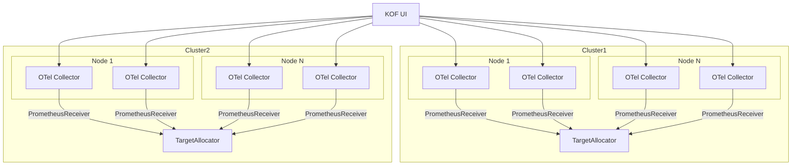

# Using KOF

## Optional Grafana

* Grafana installation and automatic configuration are now disabled in KOF by default.
* If you want to install and enable Grafana, apply the [Grafana in KOF](kof-grafana.md) guide.
* Otherwise, check the sections below, showing how to use KOF without Grafana.

## Metrics and alerts

* [Prometheus UI](kof-alerts.md/#prometheus-ui):
    * Run in the management cluster:
        ```bash
        kubectl port-forward -n kof svc/kof-mothership-promxy 8082:8082
        ```
    * Explore the Graph: [http://127.0.0.1:8082/graph?g0.expr=up&g0.tab=0](http://127.0.0.1:8082/graph?g0.expr=up&g0.tab=0)
    * Explore the Alerts: [http://127.0.0.1:8082/alerts](http://127.0.0.1:8082/alerts)
    * CLI queries for automation:
        ```bash
        curl http://localhost:8082/api/v1/query?query=up \
          | jq '.data.result | map(.metric.cluster) | unique'

        curl http://localhost:8082/api/v1/query?query=up \
          | jq '.data.result | map(.metric.job) | unique'

        curl http://localhost:8082/api/v1/query \
          -d 'query=up{cluster="mothership", job="kof-collectors-opencost"}' \
          | jq
        ```
* [Alertmanager UI](kof-alerts.md/#alertmanager-ui):
    * Run in the management cluster:
        ```bash
        kubectl port-forward -n kof svc/vmalertmanager-cluster 9093:9093
        ```
    * Open [http://127.0.0.1:9093/](http://127.0.0.1:9093/)
* [VictoriaMetrics UI](https://docs.victoriametrics.com/victoriametrics/cluster-victoriametrics/#vmui):
    * Run in the regional cluster:
        ```bash
        KUBECONFIG=regional-kubeconfig kubectl port-forward \
          -n kof svc/vmselect-cluster 8481:8481
        ```
        To get metrics stored [from Management to Management](kof-storing.md/#from-management-to-management) (if any),
        do this port-forward in the management cluster.
    * Open [http://127.0.0.1:8481/select/0/vmui/#/dashboards](http://127.0.0.1:8481/select/0/vmui/#/dashboards)

## Logs

* [VictoriaLogs UI](https://docs.victoriametrics.com/victorialogs/querying/#web-ui):
    * Run in the regional cluster:
        ```bash
        KUBECONFIG=regional-kubeconfig kubectl port-forward \
          -n kof svc/kof-storage-victoria-logs-cluster-vlselect 9471:9471
        ```
        We're using port 9471, not 9428.
    * Open [http://127.0.0.1:9471/select/vmui/](http://127.0.0.1:9471/select/vmui/)
    * CLI query for automation:
        ```bash
        curl http://127.0.0.1:9471/select/logsql/query \
          -d 'query=_time:1h' \
          -d 'limit=10'
        ```
* Run inside of Istio mesh:
    ```bash
    curl http://$REGIONAL_CLUSTER_NAME-logs-select:9471/select/logsql/query \
      -d 'query=_time:1h' \
      -d 'limit=10'
    ```
* Run without Istio and port-forwarding:
    ```bash
    VM_USER=$(
      kubectl get secret -n kof storage-vmuser-credentials -o yaml \
      | yq .data.username | base64 -d
    )
    VM_PASS=$(
      kubectl get secret -n kof storage-vmuser-credentials -o yaml \
      | yq .data.password | base64 -d
    )
    curl https://vmauth.$REGIONAL_DOMAIN/vls/select/logsql/query \
      -u "$VM_USER":"$VM_PASS" \
      -d 'query=_time:1h' \
      -d 'limit=10'
    ```

## Traces

> TODO:
> Test and document how to use [VictoriaTraces UI](https://docs.victoriametrics.com/victoriatraces/querying/#web-ui).

## Cost Management (OpenCost)

KOF includes OpenCost, which provides cost management features for Kubernetes clusters.
Common metrics (also available in the pre-installed Grafana FinOps dashboards if [enabled](kof-grafana.md)) are:

| Metric | Description |
|--------|-------------|
| `node_total_hourly_cost` | Hourly cost per node (includes CPU, memory, storage) |
| `namespace_cpu_cost` | CPU cost aggregated by namespace |
| `namespace_memory_cost` | Memory cost aggregated by namespace |
| `pod_cost` | Cost allocation at pod granularity |
| `cluster_efficiency` | Ratio of requested vs actual resource usage |

Once you have this information, you can optimize your cluster. Typical optimizations include:

* Identify under-utilized resources and right-size workloads
* Budgeting and monitoring with [alerts](kof-alerts.md)

## KOF UI

When the [TargetAllocator](https://opentelemetry.io/docs/platforms/kubernetes/operator/target-allocator/) is in use,
the configuration of [OpenTelemetryCollectors](https://opentelemetry.io/docs/collector/)
Prometheus [receivers](https://github.com/open-telemetry/opentelemetry-collector-contrib/tree/main/receiver/prometheusreceiver#prometheus-api-server)
is distributed across the cluster.

The KOF UI collects metrics metadata from the same endpoints that are scraped by the Prometheus server:



You can access the KOF UI by following these steps:

1. Forward a port to the KOF UI:

    ```bash
    kubectl port-forward -n kof deploy/kof-mothership-kof-operator 9090:9090
    ```

2. Open the link [http://127.0.0.1:9090](http://127.0.0.1:9090)

3. Check the state of the endpoints:


If there is a misconfiguration in the Prometheus targets (for example, if multiple targets scrape the same URL), the UI will display an error:


The KOF UI also allows you to monitor internal telemetry from OpenTelemetry collectors and VictoriaMetrics/Logs, enabling comprehensive observability of their health and performance.


To identify and debug issues in deployed clusters, check if KOF UI shows any errors in these monitored resources:

* ClusterDeployment
* ClusterSummaries
* MultiClusterService
* ServiceSet
* StateManagementProvider
* SveltosCluster


