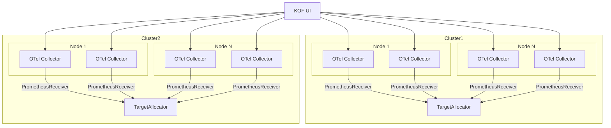

# Using KOF

## Optional Grafana



## Metrics and alerts

* [Prometheus UI](kof-alerts.md/#prometheus-ui):
    * Run in the management cluster:
        ```bash
        kubectl port-forward -n kof svc/kof-mothership-promxy 8082:8082
        ```
    * Explore the Graph: [http://127.0.0.1:8082/graph?g0.expr=up&g0.tab=0](http://127.0.0.1:8082/graph?g0.expr=up&g0.tab=0)
    * Explore the Alerts: [http://127.0.0.1:8082/alerts](http://127.0.0.1:8082/alerts)
    * CLI queries for automation:
        ```bash
        curl http://localhost:8082/api/v1/query?query=up \
          | jq '.data.result | map(.metric.cluster) | unique'

        curl http://localhost:8082/api/v1/query?query=up \
          | jq '.data.result | map(.metric.job) | unique'

        curl http://localhost:8082/api/v1/query \
          -d 'query=up{cluster="mothership", job="kof-collectors-opencost"}' \
          | jq
        ```
* [Alertmanager UI](kof-alerts.md/#alertmanager-ui):
    * Run in the management cluster:
        ```bash
        kubectl port-forward -n kof svc/vmalertmanager-cluster 9093:9093
        ```
    * Open [http://127.0.0.1:9093/](http://127.0.0.1:9093/)
* [VictoriaMetrics UI](https://docs.victoriametrics.com/victoriametrics/cluster-victoriametrics/#vmui):
    * Run in the regional cluster:
        ```bash
        KUBECONFIG=regional-kubeconfig kubectl port-forward \
          -n kof svc/vmselect-cluster 8481:8481
        ```
        To get metrics stored [from Management to Management](kof-storing.md/#from-management-to-management) (if any),
        do this port-forward in the management cluster.
    * Open [http://127.0.0.1:8481/select/0/vmui/#/dashboards](http://127.0.0.1:8481/select/0/vmui/#/dashboards)

## Logs

KOF provides access to logs through [VictoriaLogs](https://docs.victoriametrics.com/victorialogs/), a high-performance log storage and query engine. All logs collected from managed clusters are forwarded and stored centrally, allowing you to search and analyze them from a single access point. Logs are accessible via the VictoriaLogs UI for interactive exploration, or via the LogsQL API for scripting and automation.

Access is provided via a port-forward to the appropriate logs service. The management cluster aggregates logs from all regional clusters and the mothership itself, while a regional cluster port-forward scopes access to that cluster's logs only.

Run the port-forward command for your cluster type:

**Management Cluster**

```bash
kubectl port-forward -n kof svc/vlselect-kof-mothership-logs-multilevel-select 9471:9471
```

**Regional Cluster**

```bash
KUBECONFIG=regional-kubeconfig kubectl port-forward -n kof \ 
  svc/kof-storage-victoria-logs-cluster-vlselect 9471:9471
```

### VictoriaLogs UI

The [VictoriaLogs UI](https://docs.victoriametrics.com/victorialogs/querying/#web-ui) provides an interactive interface for exploring and visualizing logs. You can filter by time range, search using [LogsQL](https://docs.victoriametrics.com/victorialogs/logsql/) expressions, and inspect individual log entries.

Open [http://127.0.0.1:9471/select/vmui/](http://127.0.0.1:9471/select/vmui/)

### LogsQL API

The [LogsQL HTTP API](https://docs.victoriametrics.com/victorialogs/querying/#http-api) allows querying logs programmatically using [LogsQL](https://docs.victoriametrics.com/victorialogs/logsql/) syntax. This is suitable for scripting, alerting pipelines, and automation. The example below returns up to 10 log entries from the last hour:

```bash
curl http://127.0.0.1:9471/select/logsql/query \
  -d 'query=_time:1h' \
  -d 'limit=10'
```

## Traces

KOF provides distributed tracing through [VictoriaTraces](https://docs.victoriametrics.com/victoriatraces/). Traces are accessible via the VictoriaTraces UI or CLI using the LogsQL, Jaeger, or Tempo APIs.

Access is provided via a port-forward to the appropriate traces service. The management cluster exposes a multi-level select service that aggregates traces from all regional clusters and the mothership, while a regional cluster port-forward scopes access to that cluster's traces only.

Run the port-forward command for your cluster type:

**Management Cluster**

```bash
kubectl port-forward -n kof svc/vtselect-kof-mothership-multilevel-select 10471:10471
```

**Regional Cluster**

```bash
KUBECONFIG=regional-kubeconfig kubectl port-forward -n kof svc/kof-storage-victoria-traces-cluster-vtselect 10471:10471
```

All examples below assume the port-forward is running on `127.0.0.1:10471`.

### VictoriaTraces UI

The [VictoriaTraces UI](https://docs.victoriametrics.com/victoriatraces/querying/#web-ui) provides an interactive interface for exploring traces. You can search by service, operation, or time range, and inspect individual trace spans and their attributes.

Open [http://127.0.0.1:10471/select/vmui/](http://127.0.0.1:10471/select/vmui/)

### LogsQL API

The [LogsQL HTTP API](https://docs.victoriametrics.com/victorialogs/querying/#http-api) allows querying trace data using [LogsQL](https://docs.victoriametrics.com/victorialogs/logsql/) syntax. This is useful for integrating with automation pipelines. The example below returns up to 10 trace entries from the last hour:

```bash
curl http://127.0.0.1:10471/select/logsql/query \
  -d 'query=_time:1h' \
  -d 'limit=10'
```

### Jaeger HTTP API

The [Jaeger HTTP API](https://docs.victoriametrics.com/victoriatraces/querying/#jaeger-http-api) provides compatibility with Jaeger clients and tooling. Use it to list services, retrieve traces by service name, or integrate with dashboards that support the Jaeger data source.

List all services with recorded traces:

```bash
curl http://127.0.0.1:10471/select/jaeger/api/services
```

### Tempo HTTP API

The [Tempo HTTP API](https://docs.victoriametrics.com/victoriatraces/querying/#tempo-http-api) provides compatibility with Grafana Tempo clients, allowing VictoriaTraces to be used as a drop-in Tempo data source in Grafana.

Fetch a trace by ID:

```bash
curl http://127.0.0.1:10471/select/tempo/api/traces/<traceID>
```

## Cost Management (OpenCost)

KOF includes OpenCost, which provides cost management features for Kubernetes clusters.
Common metrics (also available in the pre-installed Grafana FinOps dashboards if [enabled](kof-grafana.md)) are:

| Metric | Description |
|--------|-------------|
| `node_total_hourly_cost` | Hourly cost per node (includes CPU, memory, storage) |
| `namespace_cpu_cost` | CPU cost aggregated by namespace |
| `namespace_memory_cost` | Memory cost aggregated by namespace |
| `pod_cost` | Cost allocation at pod granularity |
| `cluster_efficiency` | Ratio of requested vs actual resource usage |

Once you have this information, you can optimize your cluster. Typical optimizations include:

* Identify under-utilized resources and right-size workloads
* Budgeting and monitoring with [alerts](kof-alerts.md)

## KOF UI

When the [TargetAllocator](https://opentelemetry.io/docs/platforms/kubernetes/operator/target-allocator/) is in use,
the configuration of [OpenTelemetryCollectors](https://opentelemetry.io/docs/collector/)
Prometheus [receivers](https://github.com/open-telemetry/opentelemetry-collector-contrib/tree/main/receiver/prometheusreceiver#prometheus-api-server)
is distributed across the cluster.

The KOF UI collects metrics metadata from the same endpoints that are scraped by the Prometheus server:


```mermaid
graph TB
    KOF_UI[KOF UI] --> C1OTC11
    KOF_UI --> C1OTC1N
    KOF_UI --> C1OTC21
    KOF_UI --> C1OTC2N
    KOF_UI --> C2OTC11
    KOF_UI --> C2OTC1N
    KOF_UI --> C2OTC21
    KOF_UI --> C2OTC2N
    subgraph Cluster1
    subgraph C1Node1[Node 1]
        C1OTC11[OTel Collector]
        C1OTC1N[OTel Collector]
    end
    subgraph C1NodeN[Node N]
        C1OTC21[OTel Collector]
        C1OTC2N[OTel Collector]
    end

    C1OTC11 --PrometheusReceiver--> C1TA[TargetAllocator]
    C1OTC1N --PrometheusReceiver--> C1TA
    C1OTC21 --PrometheusReceiver--> C1TA
    C1OTC2N --PrometheusReceiver--> C1TA
    end
    subgraph Cluster2
    subgraph C2Node1[Node 1]
        C2OTC11[OTel Collector]
        C2OTC1N[OTel Collector]
    end
    subgraph C2NodeN[Node N]
        C2OTC21[OTel Collector]
        C2OTC2N[OTel Collector]
    end

    C2OTC11 --PrometheusReceiver--> C2TA[TargetAllocator]
    C2OTC1N --PrometheusReceiver--> C2TA
    C2OTC21 --PrometheusReceiver--> C2TA
    C2OTC2N --PrometheusReceiver--> C2TA
    end
```

You can access the KOF UI by following these steps:

1. Forward a port to the KOF UI:

    ```bash
    kubectl port-forward -n kof deploy/kof-mothership-kof-operator 9090:9090
    ```

2. Open the link [http://127.0.0.1:9090](http://127.0.0.1:9090)

3. Check the state of the endpoints:


If there is a misconfiguration in the Prometheus targets (for example, if multiple targets scrape the same URL), the UI will display an error:


The KOF UI also allows you to monitor internal telemetry from OpenTelemetry collectors and VictoriaMetrics/Logs, enabling comprehensive observability of their health and performance.


To identify and debug issues in deployed clusters, check if KOF UI shows any errors in these monitored resources:

* ClusterDeployment
* ClusterSummaries
* MultiClusterService
* ServiceSet
* StateManagementProvider
* SveltosCluster


